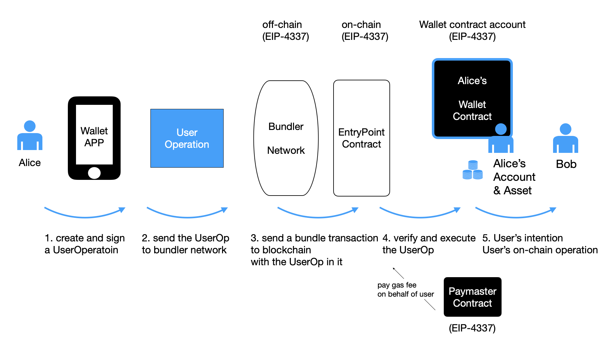

# 0. 一个使用场景

让我们先一起看一个使用场景，从应用与用户视角观察可能发生的变化。

使用场景：像使用 Web2.0 应用一样，用户以易用的方式掌管自己的链上账户——一个「钱包合约账户」，用它保管自己的链上的数字资产。用户仅需考虑如何使用自己的资产，而应用处理向链上发送交易发送、支付燃料费等麻烦。

用通俗的语言说，我们使用一个 Web3.0 版的游戏，用户的游戏积分与道具这些数字资产是在链上自托管的。我们作为用户，用一个链上的「合约钱包账户」自行掌管着自己的资产。当我们向其他用户转赠道具时，道具的转让是发生在链上。但与现在的区块链账户不同，用户可不必处理助记词、燃料费等麻烦。同时，开发者又可对钱包账户进行编程以便于用户与自己的应用交互。

EIP-4337 为这样的未来可能性提供给了一种标准化的解决方案。一个典型使用的场景的过程如图所示。

我们假设有一个 Web3.0 应用，它在自己的 APP 中为用户提供了类似 Web2.0 的注册、登录等功能，尽量做到门槛低、易用性强、又确保安全性。同时，它又采用 Web3.0 的方式为用户提供了用户自托管数字资产的链上钱包功能。它提供给用户使用的链上账户，是遵循 EIP-4337 标准的「合约钱包账户」。

我们将应用中内置的钱包功能称为「钱包APP」，用户的链上账户是一个钱包智能合约，也称为「钱包合约账户」。用户的数字资产是保管在「钱包合约」中的，资产由链下的「钱包APP」的签名与链上的钱包智能合约的签名验证代码来掌控。

图： EIP-4337 的一种用户场景

接下来，按图中所示，我们较为详尽地描述实际发生的过程，其中涉及的概念我们稍后会一一解读：

1 . 用户像使用 Web2.0 应用一样，在应用内置的用户模块中注册、登录。我们再进一步假设，用户使用应用，可获得 ERC20 Token 形式的积分奖励，应用将允许用户用 10 积分抵扣一次普通链上操作的费用，但首次创建链上钱包账户则需要额外支付 100 积分。

在实际为用户创建钱包前，我们按照预设规则可以预先计算得到用户「钱包合约账户」的地址。此时，虽然此合约并非真正在链上部署，但应用已可将数字资产（积分、道具）发送到该账户（账户A)。

2 . 用户选择创建钱包，并向其他人转赠自己的道具 NFT 。实际过程是，通过应用提供的界面和签名机制，用应用选择的签名算法与签名规则，用户对一个新的结构体「用户操作 UO」签名。在其中，用户所要求的链上操作意图是：从自己的账户（账户A）向鲍勃的账户（账户B）转账一个道具 NFT。

应用在创建「用户操作 UO」时，设定其中的代付者参数为一个代付者合约，该代付者合约同意：用户用他自己的「钱包合约账户」中的 10 积分抵扣燃料费。这个「用户操作 UO」中也包括部署钱包合约有关的字段。

3 . 打包者监控各个应用发送的「用户操作 UO」，将这个操作纳入一个「组合交易」，并将这个组合交易发送上链。打包者发送的交易真正做的是，与链上的所谓「入口点合约」进行交互。

4 . 入口点合约将进行验证、执行。在这里还涉及向代付者合约询问是否同意代付燃料费、并从其质押中扣除。（我们将在之后详细讨论入口点合约的的验证循环、执行循环）。

5 . 用户的链上操作意图（从自己账户转一个道具 NFT 给鲍勃的账户B）被执行，用户的一次链上操作完成。

用户的这个「用户操作 UO」在链上执行后，我们在链上看到如下结果：

- 用户的「钱包合约账户」，即一个钱包智能合约，被部署上链，其地址与预先计算、并存入资产的地址是一致的。
- 用户的链上操作意图，即自己的账户 A 向鲍勃的账户 B 转账一个道具 NFT ，被实际执行。
- 代付者支付燃料费，而相应地向从用户的账户 A 中收取 110 积分（创建钱包100积分、道具转账10积分）。

另外，向链上发起交易的燃料费实际上是由打包者花费的，入口点合约会将收取的燃料费补偿给打包者。

用户可继续通过「钱包APP」签名、从自己的「钱包合约账户」发起各种操作。

用户是用「钱包合约账户」来管理自己的数字资产的。用户用某种签名方式来控制自己的账户，签名的有效性是由「钱包合约」的代码验证的。其中，用户在「钱包APP」中的签名算法、签名规则与「钱包合约」中是相互对应的。入口点合约会向「钱包合约」要求验证签名是否正确。在得到确认后，入口点合约会才会调用「钱包合约」、执行用户要求的链上操作意图。

## EIP-4337 带来的六个变化

在如上这个使用场景中，我们看到，在 EIP-4337 的链上与链下组件的协助下，如下变化发生了：

- 用户可以用「钱包合约账户」作为自己在链上主钱包账户，用于托管资产、发起交易，而可选择不再必须使用 EOA外部账户。
- 用户可不必拥有 EOA 外部账户，而可以用应用及合约提供的其他方式掌控一个链上「钱包合约账户」。
- 用户不必拥有 ETH 等以支付燃料费，而可以通过代付者机制、用其他数字资产支付。
- 应用可以开发各种自定义功能的钱包合约，如允许用户逐个执行的一组任务。
- 应用可以设定代付逻辑，便利用户的使用，也可如上将之用于建立积分消耗机制等。
- 应用可以采用自己选定的签名算法与签名方案（需钱包APP签名与钱包合约验证两侧配合）。

理想的情况下，用户将不再需要一个 EOA 外部账户，也就是实现绝对的账户抽象（用户无需EOA）。

但在当前的实践中，采用其他的签名算法将给本来已经非常复杂的 EIP-4337 方案引入更多的组件。现在，我们在实际尝试运行起来 EIP-4337 代码时，多选择让用户仍是用现有的以太坊钱包（如MetaMask 或 Ethers.js 代码）、用一个 EOA 外部账户作为所有者（owner）进行签名，也即仍采用以太坊 EOA 的`secp256k1`及现有的钱包软件。

值得再次强调的是，用户实际使用的保管资产的账户是「钱包合约账户」，这个 EOA 外部账户仅仅是作为钱包的所有者而存在，而非用户实际使用的账户本身。

说明，当我们用 EOA 进行签名时，是用 EOA 的私钥按以太坊使用的 secp256k1 算法生成签名。

在接下来的讨论中，我们将主要用「用户操作 UO」这个术语指代 EIP-4337 中新出现的 UserOperation 这个新的交易对象，但在涉及代码讨论时则通常直接用 `UserOperation`。

