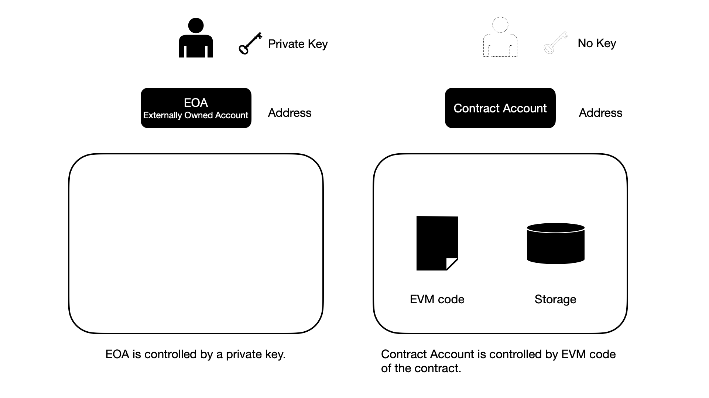
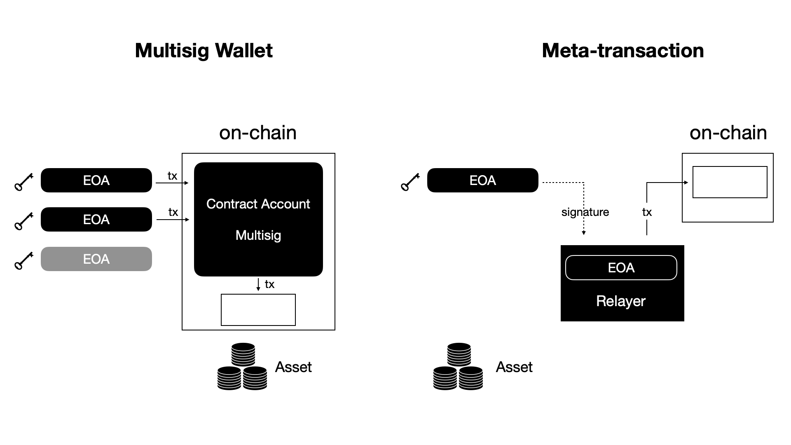
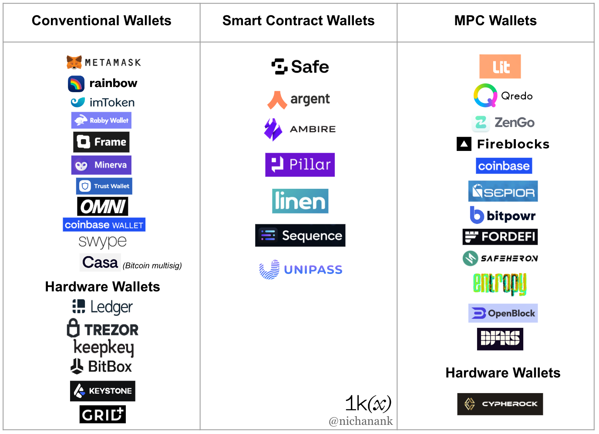

# 1. 为什么需要 EIP-4337

一个很自然的问题是，为什么要引入这么多新组件、用如此复杂的方式实现以上的特性？这需要从以太坊的账户机制及相关的各种改进说起。

## 1.1. 以太坊账户：EOA 外部账户与合约账户

以太坊区块链有两种账户：EOA 外部账户（Externally Owned Account）与合约账户(Contract Account)。

图：以太坊的两种账户：EOA 账户与合约账户

通常，用户使用的是 EOA 外部账户。例如，我们使用 MetaMask 等钱包软件建立一个身份钱包（与之对应的是助记词），然后它用助记词与路径帮我们生成一个 EOA 外部账户——一个账户是地址与私钥的组合。钱包软件为我们管理私钥，我们用私钥对交易进行签名，对链上账户进行操作。我们通常用账户来管理自己的数字资产，如ETH、ERC20 Token 或 ERC721/ERC1155 的 NFT。

以太坊区块链另有一种账户类型是合约账户。通过向以太坊部署一个智能合约程序，我们得到一个合约账户。与 EOA 外部账户不同，合约账户仅有地址，没有私钥。合约账户不是由私钥控制的，而是由其自身的代码所控制的。由于合约账户是可编程的，因此它可以执行复杂的逻辑。实际上，以太坊上的各种应用都是以合约账户的形式存在，这些合约账户可以保管资产、执行业务逻辑，而用户用 EOA 外部账户与之交互。

以太坊的最初设计给合约账户一个强限制：仅有 EOA 账户可以向链上主动发起交易事务，合约账户必须由 EOA 账户发起的交易触发。

类比来说，EOA 账户相当于经济世界中的个人，而合约账户相当于公司这样的法人主体，法人主体可以保管资产、执行复杂的业务逻辑。但这些法人主体被设置为被动的，只有个人能够主动发起交易，法人主体不能主动发起交易。

长期以来，以太坊生态中有一个重要的改进思路，就是放松这个强限制，消除对于 EOA 账户的需要，让合约账户也能主动发起链上交易，这就是所谓账户抽象（Account Abstraction）。以太坊联合创始人维塔利克·布特林（Vitalik Butterin）和相关开发者发起了多个 EIP 以太坊改进提案：

- EIP-101：货币与密码学抽象, 2015.11.15
- EIP-86：事务来源和签名抽象, 2017.2.10
- EIP-859：主网上的账户抽象, 2018.1.30
- EIP-2938：账户抽象, 2020.9.4
  - Category(类别)：Core
- EIP-4337：（无需以太坊协议修改的）账户抽象, 2021.9.29
  - Category(类别)：ERC

（对相关提案的梳理与讨论，可参看《以太坊账户抽象万字研报：拆解 10 个相关 EIP 提案与冲击千万级日活用户瓶颈的七年之路》，2022-11-15，作者：Web3Caff/十四君，[report link](https://research.web3caff.com/zh/archives/4083) )

要注意的是，之前的相关提案目前均没有实质性进展、更没有成为最终方案。例如，EIP-2938 需要对以太坊协议本身进行修改，而由于在协议底层对账户进行改动事涉重大、尤其是安全性问题，而当前以太坊有更为紧迫的开发任务，这一提案实际处于搁置状态。EIP-4337 是相关提案中最新的一个，意在无需对以太坊协议本身修改情况下，部分或全部实现账户抽象的目标。

让合约账户能够主动发起交易是非常值得探索的，从应用角度看的一个重要理由是：如果用户使用的链上账户是合约账户，那么我们可以对之进行编程，让用户的账户具有更多的功能。这里暂列一些小示例：用户账户同时向多个账户进行转账，用户账户由多个签名共同控制，用户账户用于支付周期性费用如每月支付订阅费，等等。

接下来，我们不再拘泥于账户抽象本身，而是来看看以太坊生态中各种试图改进账户机制、以让用户更方便的做法。

## 1.2. 当前实践中的以太坊账户改进

现有的 EOA 外部账户机制（用户用「私钥」控制「地址」）是在区块链领域中被证明安全与有效的。它有一系列已经成为事实性行业标准的做法支撑着（如HD钱包标准、助记词标准、多用途钱包结构标准、多币种和多账户钱包标准等），同时也有大量的相关产品可供用户使用，如钱包软件与APP、硬件钱包等。

但它有着很高的门槛，阻碍了更大量的用户进入区块链领域及Web3.0。这里举两个例子：

第一个例子是，用户实质上是用助记词来保障自己的链上账户和账户内的资产，用户应当以纸笔记录等物理方式保管好助记词，不能泄露、不能丢失。如果发生电脑丢失的情况，用户可以用助记词在新电脑上恢复钱包。但如果用户的助记词也丢失了，他将永久丢失自己的资产。而如果助记词泄露，则获得助记词的其他人也可以类似地恢复钱包，将这些资产转走。因此，按现在的方式使用链上钱包时，用户实际上是以12个单词保障可能价值成千上万美元的资产。简言之，用户用链上钱包自托管自己的资产，是有着很陡的学习曲线，且如果处理不当风险极高。

第二个例子是，用户使用链上钱包发起交易时，在以太坊链上，他需要有 ETH 这种原生通证以支付燃料费。在以太坊生态中，如果在以太坊侧链如 Polygon 或以太坊二层（L2）如 Optimism / Arbitrum，他的账户中也需要预先有相应的原生通证以支付燃料费。那么，用户如何获得它们呢？对于一个新用户，他可能需要在一些中心化交易平台进行身份认证、然后用法币兑换获得。这给试图让用户在链上掌管自己资产的 Web3.0 应用带来极大的麻烦，大量普通用户被这个障碍挡在外面。

第二个例子并非是账户抽象直接要解决的问题，但它是以太坊账户改进中必须考虑的问题。在前面的场景描述中，你可以已经注意到，EIP-4337 为这个问题提供了一种解决方案，我们可以用代付者（Paymaster）机制来规避用户必须预先拥有支付燃料费所需的原生通证的问题。

图：账户改进：多签钱包与无需燃料费的元交易

在以太坊生态中，已经出现多种实用的账户改进实践（我们主要讨论上图中的两种）。

### 1.2.1. 现有改进之一：多签钱包

一类已经被广泛普及的实践是多签钱包，即用智能合约实现多签功能的钱包合约账户。以 Safe 多签钱包（原名 Gnoiss Safe)为例，我们可以利用 Safe 多签钱包的 Web 界面创建一个「多签钱包」，这个钱包是一个特定的钱包智能合约，用于保管数字资产。我们可以设定钱包的多签规则，如三人共管、两人签名可执行交易（2-of-3），每个人用一个 EOA 账户参与这个多签钱包的管理：一个 EOA 账户发起交易，需要至少另一个 EOA 账户同意，方能动用多签钱包中的资产。

这带来的好处是，如果仅仅一人的 EOA 账户遗失或泄露，不会马上导致资产损失。同时，我们也可以变更多签钱包的多签人，让多签钱包有了更多的灵活性。多签钱包的优势在于它的钱包合约是单一功能、且经过了长期验证是可信的，缺点是相似的，它的钱包合约不能方便地支持多种多样的功能。

Argent 钱包的做法则是被广泛讨论的一种相似的改进，但它带来的主要是用户体验层次的改变。它引入所谓的监护人（Guardian）机制。它的实现方式与多签钱包类似，两者均是部署一个钱包智能合约，作为用户的账户、并保管资产。

不同的是，Argent 从用户体验出发，实现了更为复杂、同时也用户友好的功能：用户无需亲自处理助记词，它将助记词的复杂性隐在幕后，用户继续像使用 Web2.0 的互联网产品一样，用邮件与手机登录。用户可以设定其他 EOA 账户或邮件/手机作为监护人，监护人可以许可交易、锁定钱包、协助恢复钱包。这样的做法给用户带来了便利，但由于它的钱包软件、钱包合约及后端程序的功能很复杂，它的方案很难成为行业通行的标准做法。

### 1.2.2. 现有改进之二：无需燃料费的元交易

另一类改进则将着眼点放在燃料费支付问题上：如果用户的账户没有 ETH，如何让这个账户能够支付燃料费、发起交易？

一个简单直接的试验思路是很多以太坊应用开发者在学习时曾经尝试过的。假设用户 Alice 需要铸造一个 NFT，但她的 EOA 账户中没有 ETH 以支付燃料费。在实验中，我们可以这么做：1）首先进行估算，预计这个交易需要 0.012 ETH 的燃料费。2）从一个赞助账户转账 0.012 ETH 给 Alice。3）现在，Alice 就可以发起铸造 NFT 的交易了。

这样的做法在实践中其实也是可用的。用户在应用 APP 中发出请求，应用 APP 估算这次交易的燃料费并向用户转账。但很显然，这样的做法在实现上是极不优雅的，也无法标准化。

无需燃料费的元交易（meta-transaction）这个方案就产生了，即EIP-2771提案（当前仍处于评估阶段，[ EIP-2771 提案](https://eips.ethereum.org/EIPS/eip-2771)）。

在一个实验产品中，我们是这么做的：用户虽然账户中没有 ETH（实为没有 Polygon 链的原生通证 MATIC），但可仍通过网页界面铸造 NFT：用户仅需签名即可，我们创建交易、为之代付燃料费、将之提交上链执行。

在背后我们是这么做的：1）用户（账户A）对一个结构化数据进行签名，这个数据与签名是要求 NFT 合约铸造一个 NFT 给他；2）数据与签名被发送给接力者（Relayer）；3）链下的接力者（Relayer，其有一个 EOA 账户，账户Z）向链上发起交易，交易被发送到一个链上的可信的传递者合约（Forwarder）；4）NFT 合约是一个定制的合约，会将这样方式传递的交易中的发起者（msg.sender）视为是账户A（而非账户Z）。因此在最终的 NFT 合约中，所发生的铸造操作等同于是 Alice 的账户A 发起的。

这个方案是有效的，但有两个缺点。

第一个缺点是，它引入了一个我们必须信任的链下角色，即接力者。在实验中，我们使用的是 OpenZeppelin Defender 提供的接力者服务（ 包含 Webhook 代码与 EOA 账户，我们需要向账户预存 MATIC 以代为为用户的交易支付燃料费）。如果接力者不能正常工作，或者它有作恶的动机，则可能存在风险。

第二个缺点是，我们最终交互的合约（在这里即 NFT 合约）必须进行定制。这使得，只有在自己的项目中我们才能采用这种方案，而无法与链上已经存在的、未定制的合约进行交互，这大幅减少这个方案能够适用的范围。

另外，在最新文章中，投资机构 1kxnetwork 的 Nichanan Kesonpat 对当前无助记词钱包与智能钱包全景进行了完善的梳理，她将当前的钱包分为三类：常规钱包，智能合约钱包，MPC（多方安全计算）钱包。如图，我们讨论的落在中间一列即智能合约钱包这一类别。

图：钱包赛道图景，来源：Nichanan Kesonpat @1kxnetwork，文章链接：[link](https://medium.com/1kxnetwork/wallets-91c7c3457578) ，2022-11-16

在具体讨论 EIP-4337 之前，我们详细讨论多签钱包与无需燃料费的元交易两种现有实践方案是因为，EIP-4337 实际上从两种方案借鉴很多、并用更体系化、更优雅的方案实现出来。我们看到的借鉴有：

- 部署一个「钱包合约」作为用户保管资产的账户——但EIP-4337 定义了钱包合约必须实现的标准接口。
- 用户在链下对一个数据进行签名，由其他人将之纳入交易、发送上链——在 EIP-4337 中，完成这一任务的是打包者与打包者网络。
- 以及，在需要时，由第三方支付Gas——EIP-4337 提供了代付者（Paymaster）的相关标准接口。

在接下来的讨论中，我们将聚焦于以上几点，而暂时先不深入讨论引入其他的签名算法、使用聚合签名以及 EIP-4337 性能优化等议题。
