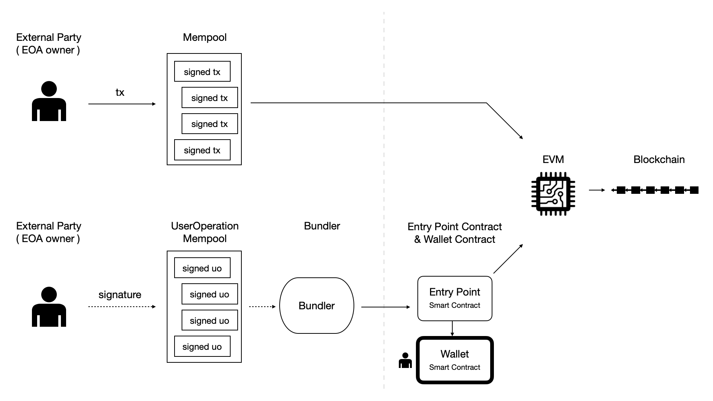
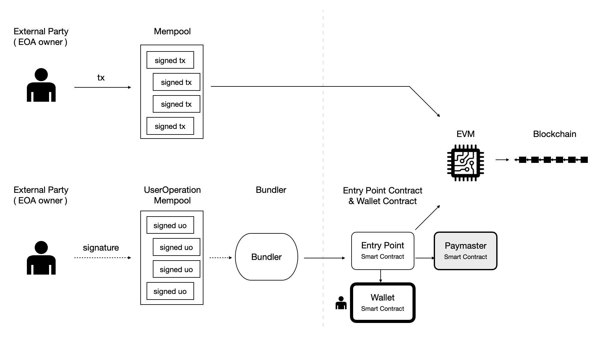
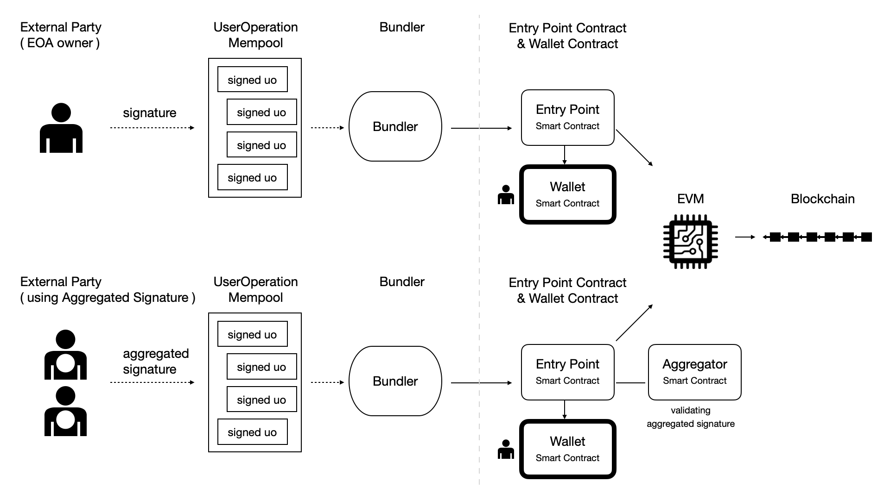

# 2. EIP-4337 的三种场景

EIP-4337 提供了一种方案，让以太坊用户可以用合约账户（这里我们称「钱包合约账户」）作为主账户，用它保管资产、用它发起交易。EIP-4337 主要有三种场景，用图示的方式解读如下。

## 2.1. 场景一：用户的「钱包合约账户」自付燃料费

图：以太坊现有交易与 EIP-4337 交易

简化起见，我们这里假设用户用一个 EOA 账户作为「钱包合约账户」的所有者 (owner)，用它按我们设定的规则进行签名，以确认所有权和同意操作。这个所有者账户仅用于签名，而不是实际保管链上资产的账户。

对比一下变化：

以太坊现有的交易是，用户账户（一个 EOA 账户，既用于签名、也用于保管链上资产）发起一个交易事务。交易执行后，状态变更被纳入最新的区块。

EIP-4337 的交易是，用户实际使用的是一个「钱包合约账户」。用户用所有者账户对一个「用户操作 UO」进行签名，其中`callData`字段中包括了用户所要实际执行的链上操作意图。签名后的 「用户操作 UO」由打包者及打包者网络进行处理，打包者将此「用户操作 UO」包含在一个组合交易中提交上链。

在链上，入口点合约对用户签名进行验证（验证在钱包合约中实现）、从用户的「钱包合约账户」收取燃料费，然后实际执行用户的链上操作意图。执行后，状态变更被纳入最新的区块。

## 2.2. 场景二：由代付者（Paymaster）支付燃料费

图：使用代付机制的 EIP-4337 交易

与场景一不同的是，用户不是从自己的「钱包合约账户」支付燃料费，而是委托代付者（Paymaster）支付燃料费。你可设想这样一种用法，用户账户中没有 ETH，但有 USDC ERC20 通证，而代付者（Paymaster）接受用户的 USDC，而对应地支付 ETH 形式的燃料费。

在这种场景中，用户创建的「用户操作 UO」中的代付者字段（`paymasterAndData`字段）不再为空，而设为代付者合约地址以及相应的参数。

当入口点合约处理这个「用户操作 UO」时，它会调用代付者合约、询问是否同意支付，并检查代付者在入口点合约中是否有足够的 ETH 质押与预存以支付燃料费。如果验证通过，入口点合约则执行「用户操作 UO」中的实际操作意图，并处理燃料费扣取（从代付者扣取）、偿付（偿付给打包者）等相关逻辑。

## 2.3. 场景三：使用聚合签名

图：使用 BLS 等聚合签名

前述两种场景中，我们假设用户提供一个签名。而 EIP-4337 还提供了使用 BLS 等聚合签名的实现机制。这是一个复杂的话题，我们这里暂不进一步深入。

我们这里仅简单描述一种场景：钱包应用的逻辑要求，一个「用户操作 UO」需要有两个外部账户签名，然后，两个签名使用 BLS 聚合为一个签名。当此「用户操作 UO」在链上进行验证时，钱包合约和入口点合约会调用「聚合签名验证 Aggregator」合约，对聚合签名进行验证。

我们看到，采用聚合签名机制后，钱包合约可以按照相对标准化的方式实现多签机制，让 EIP-4337 可以方便地实现对多签机制的支持。

采用聚合签名机制后，钱包软件也可以进一步引入 MPC（多方安全计算）机制。

