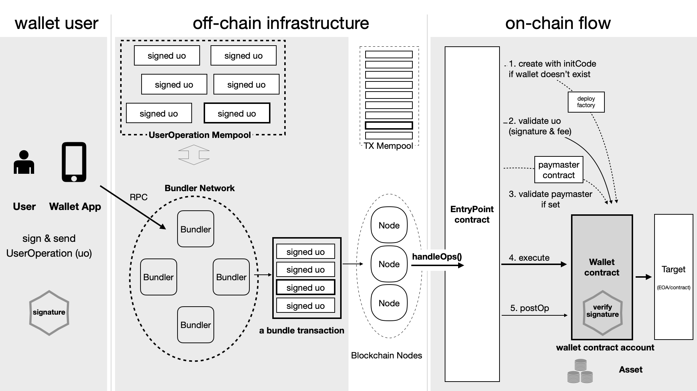

# 3. EIP-4337 的原理与组件

为了达成设计目标，让用户可以从合约账户直接发起交易，EIP-4337 引入一系列组件，主要包括三类：

1. 一个新的交易定义，即所谓用户操作（UserOperation，UserOp, UO）。这个数据结构与以太坊的交易事务（Transaction, Tx）非常接近，可视为一种伪交易对象。

2. 一组合约。包括入口点合约、钱包合约、代付者合约、聚合签名验证合约等。

3. 一组线下基础设施。链下的打包者、（去中心化的）打包者网络及它们维护的 UO 待执行内存池（UO mempool）。

当然，一个应用如果遵循 EIP-4337 为用户提供链上账户（「钱包合约账户」），通常还需提供前端界面，以让用户创建用户操作、对之签名，并将之发送到打包者网络。


图：EIP-4337 的运转逻辑，图片来源：Vitalik [link](https://medium.com/infinitism/erc-4337-account-abstraction-without-ethereum-protocol-changes-d75c9d94dc4a)

上图是维塔利克在介绍 EIP-4337 文章中的图示，它以简洁的方式介绍 EIP-4337 的主要流程：用户发起「用户操作 UO」，它们进入「UO 内存池」，打包者从中选择部分、组成「组合交易」，将之提交上链实际执行。其中，组合交易是与「入口点合约」交互。

下图是我们从应用开发者角度出发，将更多细节纳入其中绘制而成的 EIP-4377 架构图。


图：EIP-4337 的组件：用户操作（UO）定义、一组合约、线下基础设施


接下来，我们将主要转入开发者视角，尝试运行起 EIP-4337 的现有代码库，从而深入理解它的构成、运行、使用方式。通过实际运行 EIP-4337，我们能够快速地了解它的工作原理，也更清晰地理解各个组件之间的关系。


对于相关的接口标准，如各个合约的接口、打包者的 RPC 接口等，请参看 EIP-4337 中的具体定义。


## 3.1 运行 EIP-4337：通过运行理解

我们这里使用的 EIP-4337 项目组(eth-infinitism)的实现，对之进行相应的扩展，并在本地测试网运行（代码库见：[合约](https://github.com/eth-infinitism/account-abstraction)，[Bundler 及 SDK](https://github.com/eth-infinitism/bundler)）。

### 3.1.1. 准备工作：合约部署与运行打包者

我们需要执行如下的准备步骤：在本地测试网部署两个合约，并运行一个「打包者网络」。

1. 「入口点合约」：在本地测试网，部署入口点合约（EntryPoint Contract），合约地址：`0x674DF207855CE0d9eaB7B000FbBE997a2451d24f`

2. 「打包者网络」：运行仅有一个打包者（Bundler）的网络，这个打包者对应的入口点合约是上述合约，它的 RPC 地址是：`http://localhost:3000/rpc`

3. 「钱包部署者合约」：在本地测试网，部署自己的钱包合约部署者合约（`MySimpleWalletDeployer`)，合约地址：`0xD8ABE2EB9C4a571bAe3fE81435926FaA61dE5332`。

当用户创建「钱包合约账户」时，「用户操作 UO」中传入的用于创建用户的钱包合约的数据，是调用这个「钱包部署者合约」的函数，而其会以`Create2`的方式部署钱包合约。

采用这样的机制使得，在用户的钱包合约部署之前，我们可以预先计算得到用户的「钱包合约账户」地址。在我们的尝试运行中，用户的「钱包合约账户」地址是：`0x53F1424Bc492522675f799de0479af0F44dc30fB`。

我们的钱包合约（`MySimpleWallet`）的签名与验证逻辑是，用户可用一个所有者账户（一个EOA）作为它的所有者，钱包合约的代码在执行相关逻辑前，会验证签名是否是所有者的签名。

用户将用`0x53F1424Bc492522675f799de0479af0F44dc30fB`自行支付燃料费，因此这个地址中需要有ETH。虽然钱包合约仍未部署，但这里我们已经可以向「钱包合约账户」的地址转账，可向它转账 0.1 ETH 备用。

### 3.1.2. 创建钱包：首次操作钱包

在做完以上准备后，用户可以操作自己的「钱包合约账户」。有如下的典型场景：

- 用户操作「钱包合约账户」，转账其中的 ETH。
- 用户操作「钱包合约账户」，转账其中的 ERC20/ERC721 等通证，即特殊的标准化的通证合约交互。
- 用户操作「钱包合约账户」，与其他合约进行一般性的交互。

我们假设用户首次进行的是与其他合约进行一般性的交互，我们为其构造一个`callData`，并用所有者账户（一个EOA）进行签名。

接下来，我们创建「用户操作 UO」，并通过 RPC （`http://localhost:3000/rpc`）发送给打包者。

要注意的是，在此次「用户操作 UO」之前，钱包合约并未真正部署在区块链上。因此，在创建这个首次「用户操作 UO」时，我们需要填充它的`initCode`字段，以告知我们需要部署此钱包合约。通常，这个字段的实际行为是，由「钱包部署者合约」去部署钱包合约。`initCode`由「钱包合约账户」地址、对钱包部署者合约的调用数据两部分组成。

打包者将「用户操作 UO」在组合交易中提交上链，即调用入口点合约的`handleOps()`函数。组合交易中通常包括多个「用户操作 UO」。

入口点合约先执行一个验证循环，验证每一个「用户操作 UO」。在处理此「用户操作 UO」时，在验证后，将使用「initCode」部署「钱包合约」。

验证循环后，入口点合约再执行一个执行循环，执行每一个「用户操作 UO」的操作意图（`callData`）。对我们所涉及的「用户操作 UO」，入口点合约再调用「钱包合约」，执行用户指定的操作意图。

打包者在提交交易上链时，它已经支付了燃料费，这是交易被区块链执行的前提。入口点合约会计算「用户操作 UO」实际所需的燃料费，向用户的「钱包合约账户」收取。然后，入口点合约将燃料费返还给打包者。

我们可以看到，执行的最后效果是，用户的「钱包合约账户」执行了某个操作意图，并用自行支付了燃料费。

### 3.1.3. 资产转账：转账 ETH 与 ERC20 Token

目前看，要让钱包合约账户能够向其他账户转账 ETH，我们需要为之添加一个专门的转账函数（如`transfer(dest, amount)`）。

当用户要向其他账户转账 ETH 时，他的实际操作意图是：调用自己的钱包合约的`transfer(dest, amount)`函数。用户借助界面与 SDK 创建相应的 `UserOperation`，进行签名，然后提交给打包者网络处理。

```solidity
/**
 * transfer eth value to a destination address
 */
function transfer(address payable dest, uint256 amount) external onlyOwner {
    dest.transfer(amount);
}
```
图：SimpleWallet 合约中的 ETH 转账函数。值得注意的是，这个简化版的函数未考虑相关的风险如可重入攻击，仅可用于示例用途。

当用户要向其他账户转账比如 USDC 这样的 ERC20 通证时，用户是调用 USDC 合约的`transfer(...)`函数。类似地，用户创建相应的「用户操作 UO」，进行签名，然后提交给打包者网络处理。

### 3.1.4. 待付机制：代付者支付燃料费

要让代付者支付燃料费，我们需要做一些准备工作：

-  「代付者合约」：部署自己的代付者合约（`MyTokenPaymaster`），合约地址：`0x0165878A594ca255338adfa4d48449f69242Eb8F`。
-   为代付者合约在入口点合约做相应的质押 ETH 、预存 ETH ，以便能为其他人代付燃料费。

说明：为简化起见，在本文中我们未涉及入口点合约的质押、预存等部分，详细可参考 EIP-4337 提案及官方代码实现（接口：[`IStakeManager.sol`](https://github.com/eth-infinitism/account-abstraction/blob/develop/contracts/interfaces/IStakeManager.sol)。

用户与代付者有某种约定，我们假设约定是：

- 用户的「钱包合约账户」预先向代付者获得一种 ERC20 积分，一积分相当于 0.001 ETH。
- 只要用户的「钱包合约账户」中有足额的 ERC20 积分，代付者将同意以 ETH 形式代付燃料费，然后从用户账户中扣取对应的 ERC20 积分。

用户创建一个「用户操作 UO」，填入操作意图。在其中，用户设定`paymasterAndData`字段为「代付者合约」的地址。之后，用户进行签名，然后提交给打包者网络处理。

当入口点合约处理此「用户操作 UO」时，它将询问代付者合约是否同意代付燃料费，并检查代付者合约是否有足够的 ETH 质押与预存。验证通过，燃料费将由代付者的预存支付。

在执行后的环节中，代付者合约将向用户的「钱包合约账户」收取相应数量 ERC20 积分。燃料费不再是由用户的「钱包合约账户」支付 ETH。

## 3.2 EIP-4337 的组件详解

在用实际运行的方式了解了 EIP-4337 后，我们就较为容易了解它的各个组件所起的作用和相互关系。

### 3.2.1.   `UserOperation`

EIP-4337 定义了一个类似于以太坊交易事务的新结构体 `UserOperation`。用户在链下对之进行签名，然后通过打包者网络这一机制提交上链。

通过下表可以看到两者之间的异同。

|UserOperation Field      |Type       | Transaction Field    | Type    |
|--                       |--         |--                    |--       |
|`sender`                 |`address`  |`n/a`                 |         |
|`nonce`                  |`uint256`  |`nonce`               |`uint256`|
|`initCode`               |`bytes`    |`n/a`                 |         |
|`callData`               |`bytes`    |`data`                |`bytes`  |
|`callGasLimit`           |`uint256`  |`gasLimit`            |`uint256`|
|`verificationGasLimit`   |`uint256`  |`n/a`                 |         |
|`preVerificationGas`     |`uint256`  |`n/a`                 |         |
|`maxFeePerGas`           |`uint256`  |`maxFeePerGas`        |`uint256`|
|`maxPriorityFeePerGas`   |`uint256`  |`maxPriorityFeePerGas`|`uint256`|
|`paymasterAndData`       |`bytes`    |`n/a`                 |         |
|`signature`              |`bytes`    |`signature`           |`bytes`  |
|`n/a`                    |           |`receipient`          |`address`|
|`n/a`                    |           |`value`               |`uint256`|

图：UserOperation 与 Transaction 对比

特别值得注意的是，Transaction (tx)中并不包含发送者的信息，因为其由签名可以反推出来。而在 `UserOperation` 中，发送者（Sender，即用户的「钱包合约地址」）却是必需的，因为我们要在后续操作中用它来验证。

EIP-4337 是围绕`UserOperation`这个结构体展开的：

- 用户创建`UserOperatoin`，对之进行签名；
- 在链下，将签名后的`UserOperatoin`发送给某个打包者，并进入「UO Mempool」等待处理；
- 某个打包者将一组`UserOperatoin`组成组合交易，提交上链、由入口点合约处理；
- 入口点合约验证每个`UserOperatoin`，并执行其中`callData`字段的操作意图。

这里暂不一一讨论其中的燃料费相关的字段，我们可以看到它与 EIP -1559 之后的燃料费字段是相似的。

### 3.2.2. 入口点合约 EntryPoint

EIP-4337 让所有遵循其标准的钱包合约简化的方式，是引入入口点合约（EntryPoint），由其处理统一的逻辑，包括：

- 验证组合交易中的每一个`UserOperation`；
- 对每一个`UserOperation`，调用钱包合约的标准接口，验证签名的有效性（含验证聚合签名）；
- 验证能否支付燃料费，验证钱包能否自付、或验证代付者能否代付；
- 执行`UserOperation`中的操作意图；
- 处理燃料费的相关计算与逻辑：收取燃料费，将燃料费补偿给打包者；
- 处理用户、代付者用于支付燃料费的 ETH 的质押与预存。


图：EIP-4337 的组件：用户操作（UO）定义、一组合约、线下基础设施

在上图中的入口点合约部分，我们可以看到它有五步任务：

1. 如果用户的「钱包合约」尚未部署，用「用户操作 UO」中的`initCode`字段去部署合约。
2. 进入验证循环，对每一个「用户操作 UO」，验证它的有效性、验证签名的有效性，预收燃料费
3. 如果使用代付者，询问代付者合约是否同意代付、检查是否有足额的预存以支付燃料费
4. 进入执行循环，执行「用户操作 UO」中的`callData`字段，即调用「钱包合约」、实际执行用户的操作意图
5. 进行后续操作，完成向打包者进行燃料费补偿、向钱包返回多收的燃料费等任务。


图：入口点合约的处理逻辑，重点描述燃料费相关部分

上图则重点描述燃料费相关的处理逻辑，我们看到，燃料费被分为三个部分(为逐层包含关系)：

- preVerificationGas
- preOpGas
- actualGas

我们可以看到，EIP-4337 的安全性取决于「入口点合约」的代码，因此，对它的代码进行详细审查、第三方审计是必要的。只有人们对「入口点合约」的代码有足够的信心，遵循 EIP-4337 标准的「合约钱包账户」才能被广泛应用。

### 3.2.3. 打包者、打包者网络与 UO Mempool

为了「用户操作 UO」能够提交上链，而又不让这一步变得中心化，EIP-4337 引入了打包者、打包者网络、UO Mempool等一组链下组件。如前述图所示。

钱包APP在帮用户创建与签名一个「用户操作 UO」后，它将通过某个打包者的 RPC 提交到打包者网络中。在这里，钱包APP调用打包者的`eth_sendUserOperation`。

打包者网络共同维护一个类似于区块链的待执行交易内存池（tx mempool）的待执行UO内存池（UO mempool）。这就是 EIP-4337 标题中的「替代内存池」的实际含义。

某个打包者从内存池中选取一组「用户操作 UO」，组成一个组合交易（bundle transaction）。
然后它发送交易与入口点合约的`handleOp()`的交互。

当这个组合交易在链上执行完成后，其包含的一组「用户操作 UO」均实际执行完成。

目前看，EIP-4337 落地的难点主要与打包者相关：

- 打包者网络能否形成？
- 这个网络能否快速、有效地处理用户的操作？（打包者可以额外收取费用。）
- 是否有激励让打包者愿意这样处理用户的操作？
- 能否有机制让打包者不能审查相关的交易（即拒绝纳入某个 UO）？
- 能否有机制应对与最大可提取价值（MEV)类似的问题？

目前 EIP-4337 中仅对打包者的接口进行了定义，但并未深入讨论相关机制。

现在看，打包者网络的一种实现可能性是，这个功能模块作为以太坊客户端的扩展模块存在（即在以太坊客户端中，但并非属于以太坊协议层），打包者角色最终由运行以太坊客户端的验证者网络承担。

