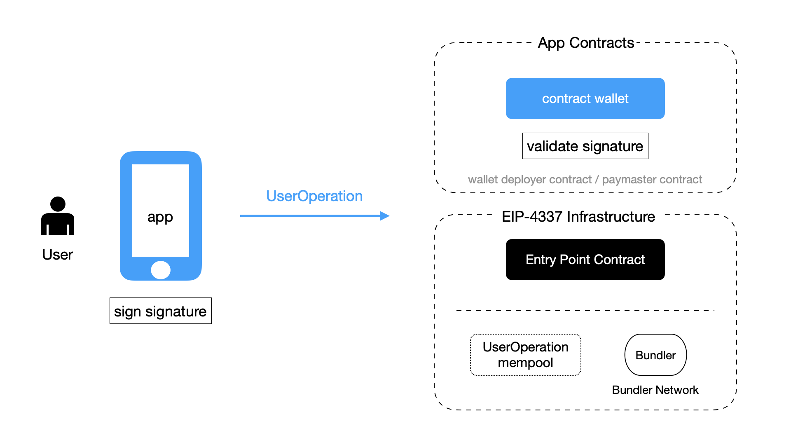
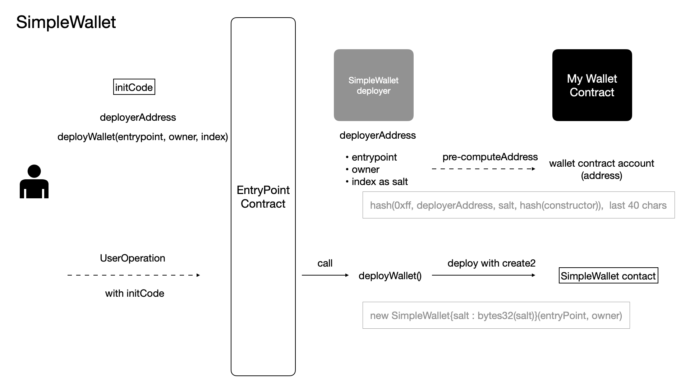
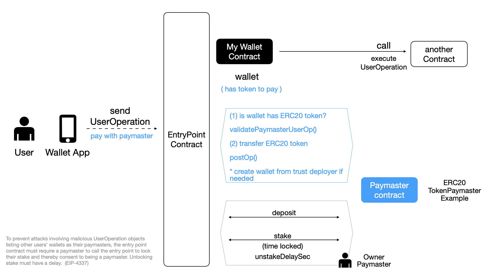

# 4. 应用与钱包开发者的视角

当应用与钱包开发者试图遵循 EIP-4337 标准进行开发时，我们假定某些基础架构已经存在，然后开发相应的模块、实现自己的业务逻辑：提供链上账户，让用户可以在链上自托管资产，提供与自身业务紧密相关的资产操作接口。

我们假定已经存在的基础架构是：

- 入口点合约，一个可信的入口点合约已经在链上部署。
- 打包者及打包者网络，打包者网络已经存在，我们可通过某个打包者的 RPC 与这个网络交互，向之提交「用户操作 UO」。

当然，如果打包者网络仍未形成（比如我们在某个以太坊二层部署钱包与应用，而打包者网络可能仅在主网存在），那么，我们可以考虑自行运行一个单节点的打包者服务、开放RPC，由它处理自己应用的「用户操作 UO」。

另外，我们还需要能处理「用户操作 UO」的客户端 SDK （如 JS SDK），钱包 APP 可以使用它来更方便地创建用户操作、对之签名、向打包者发送、处理返回的事件等。

在以下的讨论中，我们实际使用的是 EIP-4337 项目组提供的 SDK，并对它进行必要的扩展与调整，其中包含了 `WalletAPI`与`ERC4337EthersProvider`/`ERC4337EthersSigner`。这一 SDK 当前其处在可用、但未完成的状态，另外还用到项目组提供的`utils`组件。

这里，我们将采取俯瞰视角，而不一一列举具体的操作步骤。具体的运行步骤及代码解释的任务，将需要由另一篇编程教程性质的文档来完成。

## 4.1. 钱包应用的两项关键任务



如图所示，当一个应用要内置一个遵循 EIP-4337 的钱包、提供「合约钱包账户」给用户使用，有如下的两项任务需要完成：

- 合约部分：编程实现自己独特逻辑的「钱包合约」，其应按 EIP-4337 规范实现钱包合约的签名验证等接口。
- 应用部分：在应用中，提供界面让用户选择操作意图，创建「用户操作 UO」，然后由用户签名，再发送到打包者。

如果应用为用户提供特定逻辑的代付服务，则还需要相应地开发「代付者合约」。

另外，在 EIP-4337 提案中并未详细描述，但在实现中开发者必须做的是，需要实现一个辅助合约，即自己的「钱包合约部署者合约」，以让我们可预先计算「钱包合约账户」地址。

## 4.2. 钱包合约与部署者合约



如图是项目组官方示例中「SimpleWallet」的逻辑(我们扩展为`MySimpleWallet`)。当用户首次使用「钱包合约账户」发送一个「用户操作 UO」时，应用将构建一个特殊的`UserOperation`，其中包含部署合约的代码。(说明：在最新的代码迭代中，项目组官方代码将链上的实体重命名为`account`，`SimpleWallet`也相应地修改为`SimpleAccount`，[commit AA-61 link ](https://github.com/eth-infinitism/account-abstraction/commit/695e490484dbf380b9135d30b57037a0428514aa))

这个合约部署代码是调用「钱包合约部署者合约」（`MySimpleWalletDeployer`)的`deployWallet()`函数。`initCode`包括两个部分：钱包合约部署者合约地址，对`deployWallet()`的调用。

`deployWallet()` 涉及三个参数：入口点合约地址，所有者地址，`index`。在这里，一个所有者可以掌控多个「钱包合约账户」，`index` 为`0`对应着第一个，`1`对应着第二个，以此类推。与在使用 EOA 时，我们用助记词与路径掌控多个账户，这里利用 `index` 所实现效果是类似的。

```solidity
function deployWallet(IEntryPoint entryPoint, address owner, uint salt) public returns (MySimpleWallet ret) {
    address addr = getAddress(entryPoint, owner, salt);
    uint codeSize = addr.code.length;
    if (codeSize > 0) {
        return MySimpleWallet(payable(addr));
    }
    ret = new MySimpleWallet{salt : bytes32(salt)}(entryPoint, owner);
}
```
图：钱包合约部署者合约相关函数

我们以自己约定的方式将 `index` 转为 `salt` 传入。如图所示，我们又用传入的 `salt` 作为`Create2`的`salt`，这使得我们在钱包合约未部署之前也可以计算出其地址。在使用`Create2`部署一个合约时，合约的地址由三个因素决定：钱包部署者地址、部署合约的bytecode、salt。

## 4.3. 链外签名与链上签名验证

对于「用户操作 UO」，开发者可以自行定义签名的方式，并在钱包合约中相应地进行验证。

我们以官方实现中的 SimpleWallet 为例（以它为基础新创建`MySimpleWallet`），来看看链下签名与链上合约中对签名验证。

签名时，我们用 EOA 用以太坊消息签名方式对 `requestId`进行签名(说明：在一次最新的代码更新中，这个变量的名称变更为`userOpHash`，[link](https://github.com/eth-infinitism/account-abstraction/commit/cebd672bc538279771fbddffed04f366a6ba16eb))。在Ethers.js中，这种签名为`signMessage() `。相关的代码片段如下(它们来自不同的文件，这里摘出整合到一起展示)：

```js
async signUserOp (userOp: UserOperationStruct): Promise<UserOperationStruct> {
  const requestId = await this.getRequestId(userOp)
  const signature = this.signRequestId(requestId)
  return {
    ...userOp,
    signature
  }
}

async signRequestId (requestId: string): Promise<string> {
  return await this.owner.signMessage(arrayify(requestId))
}
```
图：链下对文本消息进行签名

我们看到，在这个样例钱包（`MySimpleWallet`）中，在链下，生成签名的方式是：

- 用`UserOperatoin`、入口点合约地址、`chainId` 按规则生成`requestId`(按现在代码的变化其将会被重命名为`userOpHash`)
- 所有者 EOA 用 `signMessage()`对`requestId`的文本进行签名。

以太坊的`signMessage()`签名方式是，在文本前添加前缀"\x19Ethereum Signed Message:\n"、文本长度，然后对这一新文本的哈希进行签名。

对应地，在链上，钱包合约以相同的方式进行签名验证：

```solidity
/// implement template method of BaseWallet
function _validateSignature(UserOperation calldata userOp, bytes32 requestId, address) internal view virtual override {
    bytes32 hash = requestId.toEthSignedMessageHash();
    require(owner == hash.recover(userOp.signature), "wallet: wrong signature");
}
```
图：在链上，在钱包合约中，对签名进行验证

用户是通过应用在链下的签名、钱包合约在链上的验证来掌控「钱包合约账户」，并相应地掌控账户地址中的资产的。因此，签名算法、签名方式至关重要。只要遵循 EIP-4337 中的要求，我们可以自行定义签名与验证签名的方式。但总的来说，以上这样的签名（用EOA及以太坊的`secp256k1`算法对`requestId`进行签名）与在链上钱包中相应地验证签名的方式，已经可以满足多数场景中钱包应用与钱包合约的需要。

## 4.4. 代付者合约



如果要使用代付者(Paymaster)机制，那么我们需要编程实现自己的代付者合约，在链上进行部署。代付者合约要预先在入口点合约中预存与质押。如图所示。

当用户发起一个操作意图时，如果用户可选择代付，应用相应地设置`paymasterAndData`字段。对应地，代付者合约响应入口点合约的调用，对是否可代付燃料费进行确认。

我们与用户之间采取何种规则达成代付关系，是在代付者合约中具体实现的。

通过如上讨论我们看到，EIP-4337 包含了众多组件（链上合约、链下打包者），而应用要遵循这一标准，需要理解各个组件之间的逻辑，并对应地开发自己的实现模块（钱包合约、代付者合约及前端代码）。

