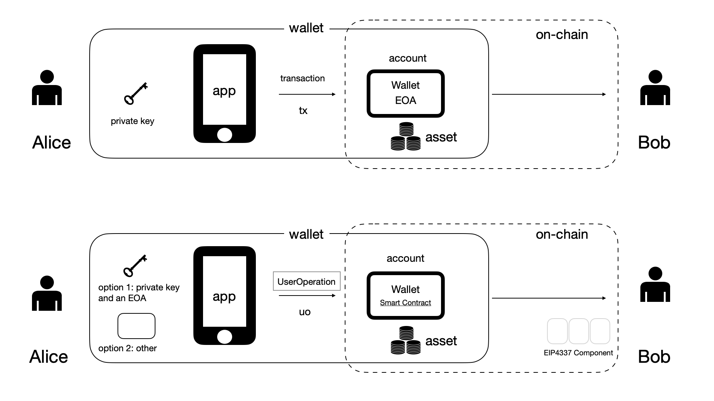

# 5. 总结与展望

图：用户用「钱包合约账户」作为主账户

EIP-4337 为以太坊走向无需 EOA 外部账户、仅需合约账户的账户抽象奠定了基础。如图所示，用户可以用「钱包合约账户」作为自己管理链上资产、发起链上操作的主账户。

EIP-4337 是各项相关提案中最接近于可实现的方案。它可能起到类似于 ERC20/ERC721 等通证标准的作用，为「钱包合约账户」标准化开创道路。

EIP-4337 带来的三大特性是：

1. **提出了用智能合约实现「钱包合约账户」的标准化方案**。在链上，钱包合约和入口点合约处理用户的请求；在链下，用户签署所谓「用户操作 UO」，并通过无中心的打包者网络提交上链。用户们提交的「用户操作 UO」进入一个新的待执行内存池，打包者可选择一些「用户操作 UO」、将之组成一个「组合交易」，然后将此交易发送上链与「入口点合约」交互。

2. **提供了实现账户抽象（即用户无需 「EOA 外部账户」、仅需「合约账户」）的可行路径**。例如，用户可用钱包软件APP设定的方式签名「用户操作 UO」，该签名可由链上的钱包合约对应地验证。用户无需自己通过 EOA 外部账户向链上发起交易，这消除了对 EOA 的需要。钱包软件 APP 可以自行选择签名方案，同时也可以引入采用 BLS 等聚合签名算法。这一 EIP 提案无需对以太坊协议进行变更，其亦为ERC系列提案，可在 L2、侧链、EVM 兼容链上实现。

3. **提供了标准化的燃料费的代付方式，即代付者（Paymaster）机制**。用户在「用户操作 UO」中，可选择自行支付燃料费，若在以太坊链上，这需要钱包合约账户中有 ETH 以进行支付。用户也可以选择由第三方代付者（即 Paymaster 链上合约）代付，遵循相应技术规范的代付者可按与用户商定条件进行代付，如向用户收取 ERC20 通证、而代付 ETH。

EIP-4337 若能快速成为最终提案、并被各种应用广泛接纳、真正成为事实性行业标准，可以大幅度降低普通用户使用区块链应用（或 Web3.0 应用）的门槛。届时，一个应用能否兼容 EIP-4337，则将影响自己能否利用整个以太坊生态的其他组件以实现快速发展。

因此，现在，应用开发者就应该高度关注 EIP-4337、掌握其具体实现逻辑，并严肃考虑以兼容它的方式开发自身应用内钱包的。
